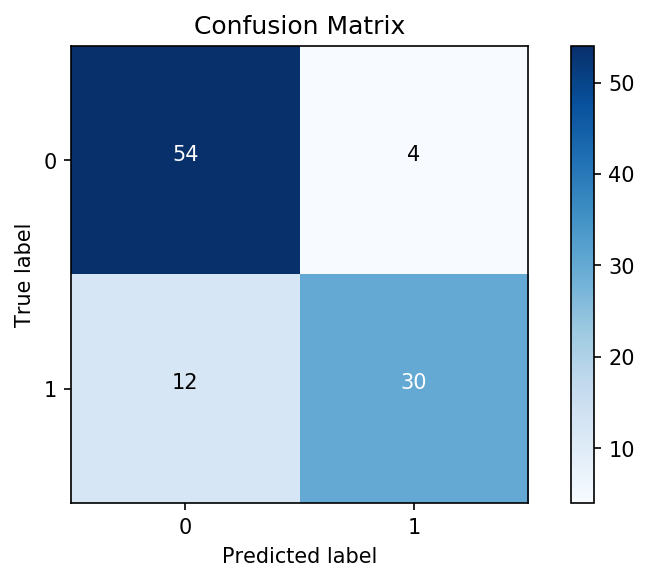

# Logistic Regression


```python
import pandas as pd
import itertools
import seaborn as sns
import matplotlib.pyplot as plt
%matplotlib inline
import seaborn as sns
import numpy as np
from sklearn.linear_model import Lasso, Ridge
import pickle
from sklearn.metrics import roc_curve, roc_auc_score, accuracy_score
from sklearn.linear_model import LogisticRegression
from sklearn.model_selection import train_test_split
from sklearn.preprocessing import StandardScaler
```

### 1) Why is logistic regression typically better than linear regression for modeling a binary target/outcome?


```python
"""
Your written answer here
"""
```

<!---
# load data
ads_df = pd.read_csv("raw_data/social_network_ads.csv")

# one hot encode categorical feature
def is_female(x):
    """Returns 1 if Female; else 0"""
    if x == "Female":
        return 1
    else:
        return 0
        
ads_df["Female"] = ads_df["Gender"].apply(is_female)
ads_df.drop(["User ID", "Gender"], axis=1, inplace=True)
ads_df.head()

# separate features and target
X = ads_df.drop("Purchased", axis=1)
y = ads_df["Purchased"]

# train/test split
X_train, X_test, y_train, y_test = train_test_split(X, y, random_state=19)

# preprocessing
scale = StandardScaler()
scale.fit(X_train)
X_train = scale.transform(X_train)
X_test = scale.transform(X_test)

# save preprocessed train/test split objects
pickle.dump(X_train, open("write_data/social_network_ads/X_train_scaled.pkl", "wb"))
pickle.dump(X_test, open("write_data/social_network_ads/X_test_scaled.pkl", "wb"))
pickle.dump(y_train, open("write_data/social_network_ads/y_train.pkl", "wb"))
pickle.dump(y_test, open("write_data/social_network_ads/y_test.pkl", "wb"))

# build model
model = LogisticRegression(C=1e5, solver="lbfgs")
model.fit(X_train, y_train)
y_test_pred = model.predict(X_test)
y_train_pred = model.predict(X_train)

from sklearn.metrics import confusion_matrix

# create confusion matrix
# tn, fp, fn, tp
cnf_matrix = confusion_matrix(y_test, y_test_pred)
cnf_matrix

# build confusion matrix plot
plt.imshow(cnf_matrix,  cmap=plt.cm.Blues) #Create the basic matrix.

# Add title and Axis Labels
plt.title('Confusion Matrix')
plt.ylabel('True label')
plt.xlabel('Predicted label')

# Add appropriate Axis Scales
class_names = set(y_test) #Get class labels to add to matrix
tick_marks = np.arange(len(class_names))
plt.xticks(tick_marks, class_names)
plt.yticks(tick_marks, class_names)

# Add Labels to Each Cell
thresh = cnf_matrix.max() / 2. #Used for text coloring below
#Here we iterate through the confusion matrix and append labels to our visualization.
for i, j in itertools.product(range(cnf_matrix.shape[0]), range(cnf_matrix.shape[1])):
        plt.text(j, i, cnf_matrix[i, j],
                 horizontalalignment="center",
                 color="white" if cnf_matrix[i, j] > thresh else "black")

# Add a Side Bar Legend Showing Colors
plt.colorbar()

# Add padding
plt.tight_layout()
plt.savefig("visuals/cnf_matrix.png",
            dpi=150,
            bbox_inches="tight")
--->



### 2) Using the confusion matrix above, calculate precision, recall, and F-1 score.
Show your work, not just your final numeric answer


```python
# Your code here to calculate precision
```


```python
# Your code here to calculate recall
```


```python
# Your code here to calculate F-1 score
```

### 3)  What is a real life example of when you would care more about recall than precision? Make sure to include information about errors in your explanation.


```python
"""
Your written answer here
"""
```

<!---
# save preprocessed train/test split objects
X_train = pickle.load(open("write_data/social_network_ads/X_train_scaled.pkl", "rb"))
X_test = pickle.load(open("write_data/social_network_ads/X_test_scaled.pkl", "rb"))
y_train = pickle.load(open("write_data/social_network_ads/y_train.pkl", "rb"))
y_test = pickle.load(open("write_data/social_network_ads/y_test.pkl", "rb"))

# build model
model = LogisticRegression(C=1e5, solver="lbfgs")
model.fit(X_train, y_train)
y_test_pred = model.predict(X_test)
y_train_pred = model.predict(X_train)

labels = ["Age", "Estimated Salary", "Female", "All Features"]
colors = sns.color_palette("Set2")
plt.figure(figsize=(10, 8))
# add one ROC curve per feature
for feature in range(3):
    # female feature is one hot encoded so it produces an ROC point rather than a curve
    # for this reason, female will not be included in the plot at all since it is
    # disingeneuous to call it a curve.
    if feature == 2:
        pass
    else:
        X_train_feat = X_train[:, feature].reshape(-1, 1)
        X_test_feat = X_test[:, feature].reshape(-1, 1)
        logreg = LogisticRegression(fit_intercept=False, C=1e12, solver='lbfgs')
        model_log = logreg.fit(X_train_feat, y_train)
        y_score = model_log.decision_function(X_test_feat)
        fpr, tpr, thresholds = roc_curve(y_test, y_score)
        lw = 2
        plt.plot(fpr, tpr, color=colors[feature],
                 lw=lw, label=labels[feature])

# add one ROC curve with all the features
model_log = logreg.fit(X_train, y_train)
y_score = model_log.decision_function(X_test)
fpr, tpr, thresholds = roc_curve(y_test, y_score)
lw = 2
plt.plot(fpr, tpr, color=colors[3], lw=lw, label=labels[3])

# create foundation of the plot
plt.plot([0, 1], [0, 1], color='navy', lw=lw, linestyle='--')
plt.xlim([0.0, 1.0])
plt.ylim([0.0, 1.05])
plt.yticks([i / 20.0 for i in range(21)])
plt.xticks([i / 20.0 for i in range(21)])
plt.xlabel("False positive rate")
plt.ylabel("True positive rate")
plt.title("ROC Curve")
plt.legend()
plt.tight_layout()
plt.savefig("visuals/many_roc.png",
            dpi=150,
            bbox_inches="tight")
--->


### 4) Which ROC curve from the above graph is the best? Explain your reasoning.

Note: each ROC curve represents one model, each labeled with the feature(s) inside each model.


```python
"""
Your written answer here
"""
```

### Logistic Regression Example

The following cell includes code to train and evaluate a model

<!---
# sorting by 'Purchased' and then dropping the last 130 records
dropped_df = ads_df.sort_values(by="Purchased")[:-130]
dropped_df.reset_index(inplace=True)
pickle.dump(dropped_df, open("write_data/sample_network_data.pkl", "wb"))
--->


```python
# Run this cell without changes

network_df = pickle.load(open('write_data/sample_network_data.pkl', 'rb'))

# partion features and target 
X = network_df.drop('Purchased', axis=1)
y = network_df['Purchased']

# train test split
X_train, X_test, y_train, y_test = train_test_split(X, y, random_state=2019)

# scale features
scale = StandardScaler()
scale.fit(X_train)
X_train = scale.transform(X_train)
X_test = scale.transform(X_test)

# build classifier
model = LogisticRegression(C=1e5, solver='lbfgs')
model.fit(X_train, y_train)
y_test_pred = model.predict(X_test)

# get the accuracy score
print(f'The classifier has an accuracy score of {round(accuracy_score(y_test, y_test_pred), 3)}.')
```

### 5) The model above has an accuracy score that might be too good to believe. Using `y.value_counts()`, explain how `y` is affecting the accuracy score.


```python
# Run this cell without changes
y.value_counts()
```


```python
"""
Your written answer here
"""
```

### 6) What is one method you could use to improve your model to address the issue discovered in Question 5?


```python
"""
Your written answer here
"""
```
