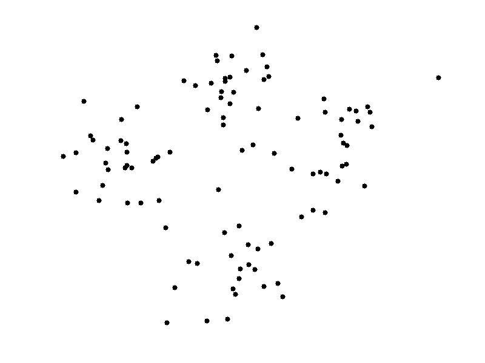

## Clustering 

### Clustering Algorithms: k-means and hierarchical agglomerative clustering

#### 1) Using the gif below for reference, describe the steps of the k-means clustering algorithm.
* If the gif doesn't run, you may access it via [this link](images/centroid.gif).




```python
# Your written answer here
```

#### 2) In a similar way, describe the process behind Hierarchical Agglomerative Clustering.


```python
# Your written answer here
```

### k-means Clustering

For this question, you will apply k-means clustering to your now friend, the wine dataset. 

You will use scikit-learn to fit k-means clustering models, and you will determine the optimal number of clusters to use by looking at silhouette scores. 

We load the wine dataset for you in the cell below. 


```python
import pandas as pd
from sklearn.datasets import load_wine

X, y = load_wine(return_X_y=True)
wine = load_wine()
X = pd.DataFrame(X, columns = wine.feature_names)
```

**3) Write a function called `get_labels` that will find `k` clusters in a dataset of features `X`, and return the labels for each row of `X`.**

_Hint: make sure you include any necessary import(s)_


```python
def get_labels(k, X):
    # Your code here
    
    # a) Instantiate a k-means clustering model with random_state=1 and n_clusters=k
    # b) Fit the model to the data
    # c) return the predicted labels for each row in the data
```

**4) Fit the k-means algorithm to the wine data for k values in the range 2 to 9 using the function you've written above. Obtain the silhouette scores for each trained k-means clustering model, and place the values in a list called `silhouette_scores`.** 

We have provided you with some starter code in the cell below.

_Hints: What imports do you need? Do you need to pre-process the data in any way before fitting the k-means clustering algorithm?_ 


```python
# Your code here
# a) Relevant imports

# b) Any preprocessing

silhouette_scores= []

for k in range(2, 10):
    # c) Get labels
    
    # d) Get score for labels (metric='euclidean')
    
    silhouette_scores.append(score)
```

Run the cell below to plot the silhouette scores obtained for each different value of k against k, the number of clusters we asked the algorithm to find. 


```python
import matplotlib.pyplot as plt
%matplotlib inline
```


```python
plt.plot(range(2, 10), silhouette_scores, marker='o')
plt.title('Silhouette scores vs number of clusters')
plt.xlabel('k (number of clusters)')
plt.ylabel('silhouette score')
```

**5) Which value of k would you choose based on the plot of silhouette scores? How does this number compare to the number of classes in the wine dataset?**

Hint: this number should be <= 5.  If it's not, check your answer in the previous section.


```python
# Your answer here 
```
