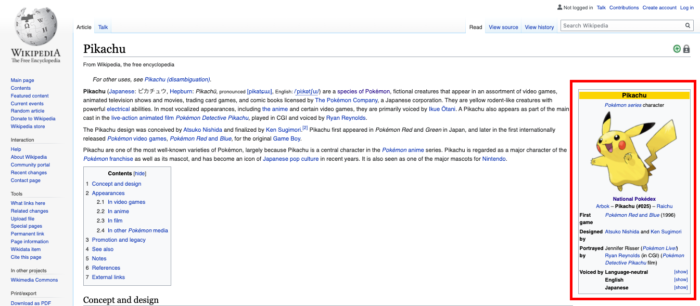

# APIs and Web Scraping


```python
import requests
import json
from bs4 import BeautifulSoup
```

In this assessment you will primarily be exploring a Pokemon dataset. Pokemon are fictional creatures from the [Nintendo franchise](https://en.wikipedia.org/wiki/Pok%C3%A9mon) of the same name.

Some Pokemon facts that might be useful:
* The word "pokemon" is both singular and plural. You may refer to "one pokemon" or "many pokemon".
* Pokemon have attributes such as a name, weight, and height.
* Pokemon have one or multiple "types". A type is something like "electric", "water", "ghost", or "normal" that indicates the abilities that pokemon may possess.
* The humans who collect pokemon are called "trainers".

## 1. Accessing Data Through APIs

We'll be using the PokéAPI to get data on Pokemon. 

[Consult the PokéAPI documentation here](https://pokeapi.co/docs/v2.html) for information on obtaining data from this API.

We want to know the "types" of any particular pokemon given its name. Complete the `get_pokemon_types` function below. It should return a `list` of all the names of the "types" that pokemon has

Within `get_pokemon_types`, make a request to `"https://pokeapi.co/api/v2/pokemon/<add-name-of-pokemon-here>"`. Inspect the API response and extract the names of the types. Here are the [docs for this specific API route](https://pokeapi.co/docs/v2.html/#pokemon).

Example usage of `get_pokemon_types`:

```
get_pokemon_types("pikachu")   # returns ["electric"]
get_pokemon_types("bulbasaur") # returns ["poison", "grass"]
get_pokemon_types("snorlax")   # returns ["normal"]
get_pokemon_types("moltres")   # returns ["flying", "fire"]
```


```python
def get_pokemon_types(name):
    '''
    input: name - a string of the pokemon's name
    
    return: a list of strings of the one or more types belonging to the pokemon
    '''
    url = f"https://pokeapi.co/api/v2/pokemon/{name}"
    poke_data = requests.get(url).json()
    
    return [type_data["type"]["name"] for type_data in poke_data["types"]]
```


```python
get_pokemon_types("bulbasaur")
```


    ['poison', 'grass']


## 2. Accessing Data Through Web Scraping

The PokéAPI has lots of information about pokemon, but it doesn't have everything!

Use [BeautifulSoup](https://www.crummy.com/software/BeautifulSoup/bs4/doc/) to find the designer(s) of a pokemon by scraping Wikipedia.  (Note: this only works for pokemon that are "notable" enough to have a Wikipedia page.)

For example, [this is the Wikipedia page for Pikachu](https://en.wikipedia.org/wiki/Pikachu).  Before writing the following function, make sure you go to the site and inspect the page.  Look at the structure of the HTML elements in the info box (highlighted in red in the image below).



Complete the `get_pokemon_designers` function below.  It should return a **string** representing the designer(s) of the pokemon.  We have already completed the initial request for you.

There are four steps to extract this information from the `soup` object:

1. Find the `info_box` by searching `soup` for a `table` HTML tag with `class` `"infobox"`
2. Find the `fifth_row` by searching `info_box` for `tr` HTML tags and selecting the fifth one (index 4)
3. Find the `table_cell` by searching `fifth_row` for a `td` HTML tag
4. Find the `designers` by extracting the `text` from `table_cell`

Example usage of `get_pokemon_designers`:

```
get_pokemon_designers("pikachu")   # returns 'Atsuko Nishida and Ken Sugimori'
get_pokemon_designers("bulbasaur") # returns 'Atsuko Nishida[1]'
get_pokemon_designers("snorlax")   # returns 'Ken Sugimori'
get_pokemon_designers("moltres")   # returns 'Ken Sugimori'
```


```python

def get_pokemon_designers(name):
    '''
    input: name - a string of the pokemon's name
    
    return: a string representing the designer(s) of the pokemon
    '''
    wikipedia_page = requests.get(f"https://en.wikipedia.org/wiki/{name}")
    soup = BeautifulSoup(wikipedia_page.content, "html.parser")
    
    # Search soup for a table HTML tag with class "infobox"
    info_box = soup.find("table", attrs={"class": "infobox"})
    
    # Search info_box for tr HTML tags and select the fifth one (index 4)
    fifth_row = info_box.find_all("tr")[4]
    
    # Search fifth_row for a td HTML tag
    table_cell = fifth_row.find("td")
    
    # Extract the text from table_cell
    designers = table_cell.text
    
    return designers
```


```python
get_pokemon_designers("pikachu")
```


    'Atsuko Nishida and Ken Sugimori'


