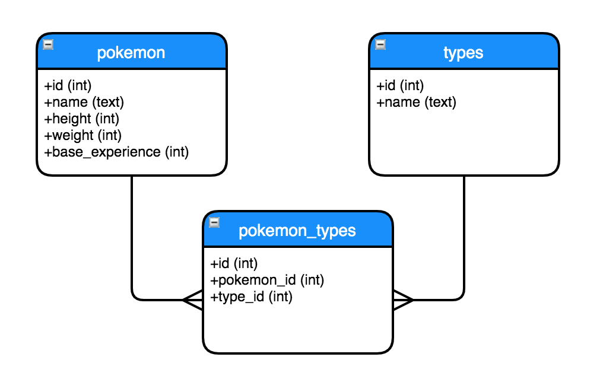

## SQL and Relational Databases

In this checkpoint you will be exploring a Pokemon dataset that has been put into SQL tables. Pokemon are fictional creatures from the [Nintendo franchise](https://en.wikipedia.org/wiki/Pok%C3%A9mon) of the same name.

Some Pokemon facts that might be useful:
* The word "pokemon" is both singular and plural. You may refer to "one pokemon" or "many pokemon".
* Pokemon have attributes such as a name, weight, and height.
* Pokemon have one or multiple "types". A type is something like "electric", "water", "ghost", or "normal" that indicates the abilities that pokemon may possess.
* The humans who collect pokemon are called "trainers".

The schema of `pokemon.db` is as follows:



Assign your SQL queries as strings to the variables `q1`, `q2`, etc. and run the cells at the end of this section to print your results as Pandas DataFrames.

- `q1`: Find all the pokemon on the "pokemon" table. Display all columns.  

  
- `q2`: Find all the rows from the "pokemon_types" table where the type_id is 3.


- `q3`: Find all the rows from the "pokemon_types" table where the associated type is "water". Do so without hard-coding the id of the "water" type, using only the name.


- `q4`: Find the names of all pokemon that have the "psychic" type.


- `q5`: Find the average weight for each type. Order the results from highest weight to lowest weight. Display the type name next to the average weight.


- `q6`: Find the names and ids of all the pokemon that have more than 1 type.


- `q7`: Find the id of the type that has the most pokemon. Display type_id next to the number of pokemon having that type. 


**Important note on syntax**: use `double quotes ""` when quoting strings **within** your query and wrap the entire query in `single quotes ''`.

**DO NOT MODIFY THE PYTHON CODE BELOW (e.g. `pd.read_sql`). YOU ONLY NEED TO MODIFY THE SQL QUERY STRINGS.**


```python
# import the necessary libraries
import pandas as pd
import sqlite3
```


```python
cnx = sqlite3.connect('data/pokemon.db')
```

### Question 1: Find all the pokemon on the "pokemon" table. Display all columns.


```python
q1 = 'SELECT * FROM pokemon'
pd.read_sql(q1, cnx)
```


<div>
<style scoped>
    .dataframe tbody tr th:only-of-type {
        vertical-align: middle;
    }

    .dataframe tbody tr th {
        vertical-align: top;
    }

    .dataframe thead th {
        text-align: right;
    }
</style>
<table border="1" class="dataframe">
  <thead>
    <tr style="text-align: right;">
      <th></th>
      <th>id</th>
      <th>name</th>
      <th>base_experience</th>
      <th>weight</th>
      <th>height</th>
    </tr>
  </thead>
  <tbody>
    <tr>
      <th>0</th>
      <td>1</td>
      <td>bulbasaur</td>
      <td>64</td>
      <td>69</td>
      <td>7</td>
    </tr>
    <tr>
      <th>1</th>
      <td>2</td>
      <td>ivysaur</td>
      <td>142</td>
      <td>130</td>
      <td>10</td>
    </tr>
    <tr>
      <th>2</th>
      <td>3</td>
      <td>venusaur</td>
      <td>236</td>
      <td>1000</td>
      <td>20</td>
    </tr>
    <tr>
      <th>3</th>
      <td>4</td>
      <td>charmander</td>
      <td>62</td>
      <td>85</td>
      <td>6</td>
    </tr>
    <tr>
      <th>4</th>
      <td>5</td>
      <td>charmeleon</td>
      <td>142</td>
      <td>190</td>
      <td>11</td>
    </tr>
    <tr>
      <th>...</th>
      <td>...</td>
      <td>...</td>
      <td>...</td>
      <td>...</td>
      <td>...</td>
    </tr>
    <tr>
      <th>146</th>
      <td>147</td>
      <td>dratini</td>
      <td>60</td>
      <td>33</td>
      <td>18</td>
    </tr>
    <tr>
      <th>147</th>
      <td>148</td>
      <td>dragonair</td>
      <td>147</td>
      <td>165</td>
      <td>40</td>
    </tr>
    <tr>
      <th>148</th>
      <td>149</td>
      <td>dragonite</td>
      <td>270</td>
      <td>2100</td>
      <td>22</td>
    </tr>
    <tr>
      <th>149</th>
      <td>150</td>
      <td>mewtwo</td>
      <td>306</td>
      <td>1220</td>
      <td>20</td>
    </tr>
    <tr>
      <th>150</th>
      <td>151</td>
      <td>mew</td>
      <td>270</td>
      <td>40</td>
      <td>4</td>
    </tr>
  </tbody>
</table>
<p>151 rows × 5 columns</p>
</div>


### Question 2: Find all the rows from the "pokemon_types" table where the type_id is 3.


```python
q2 = 'SELECT * FROM pokemon_types WHERE type_id = 3'
pd.read_sql(q2, cnx)
```


<div>
<style scoped>
    .dataframe tbody tr th:only-of-type {
        vertical-align: middle;
    }

    .dataframe tbody tr th {
        vertical-align: top;
    }

    .dataframe thead th {
        text-align: right;
    }
</style>
<table border="1" class="dataframe">
  <thead>
    <tr style="text-align: right;">
      <th></th>
      <th>id</th>
      <th>pokemon_id</th>
      <th>type_id</th>
    </tr>
  </thead>
  <tbody>
    <tr>
      <th>0</th>
      <td>10</td>
      <td>6</td>
      <td>3</td>
    </tr>
    <tr>
      <th>1</th>
      <td>17</td>
      <td>12</td>
      <td>3</td>
    </tr>
    <tr>
      <th>2</th>
      <td>25</td>
      <td>16</td>
      <td>3</td>
    </tr>
    <tr>
      <th>3</th>
      <td>27</td>
      <td>17</td>
      <td>3</td>
    </tr>
    <tr>
      <th>4</th>
      <td>29</td>
      <td>18</td>
      <td>3</td>
    </tr>
    <tr>
      <th>5</th>
      <td>33</td>
      <td>21</td>
      <td>3</td>
    </tr>
    <tr>
      <th>6</th>
      <td>35</td>
      <td>22</td>
      <td>3</td>
    </tr>
    <tr>
      <th>7</th>
      <td>59</td>
      <td>41</td>
      <td>3</td>
    </tr>
    <tr>
      <th>8</th>
      <td>61</td>
      <td>42</td>
      <td>3</td>
    </tr>
    <tr>
      <th>9</th>
      <td>123</td>
      <td>83</td>
      <td>3</td>
    </tr>
    <tr>
      <th>10</th>
      <td>125</td>
      <td>84</td>
      <td>3</td>
    </tr>
    <tr>
      <th>11</th>
      <td>127</td>
      <td>85</td>
      <td>3</td>
    </tr>
    <tr>
      <th>12</th>
      <td>178</td>
      <td>123</td>
      <td>3</td>
    </tr>
    <tr>
      <th>13</th>
      <td>187</td>
      <td>130</td>
      <td>3</td>
    </tr>
    <tr>
      <th>14</th>
      <td>205</td>
      <td>142</td>
      <td>3</td>
    </tr>
    <tr>
      <th>15</th>
      <td>208</td>
      <td>144</td>
      <td>3</td>
    </tr>
    <tr>
      <th>16</th>
      <td>210</td>
      <td>145</td>
      <td>3</td>
    </tr>
    <tr>
      <th>17</th>
      <td>212</td>
      <td>146</td>
      <td>3</td>
    </tr>
    <tr>
      <th>18</th>
      <td>216</td>
      <td>149</td>
      <td>3</td>
    </tr>
  </tbody>
</table>
</div>


### Question 3: Find all the rows from the "pokemon_types" table where the associated type is "water". Do so without hard-coding the id of the "water" type, using only the name.


```python
q3 = '''
SELECT pokemon_types.*
FROM pokemon_types
INNER JOIN types 
    ON types.id = pokemon_types.type_id
WHERE types.name = "water"
'''
pd.read_sql(q3, cnx)
```


<div>
<style scoped>
    .dataframe tbody tr th:only-of-type {
        vertical-align: middle;
    }

    .dataframe tbody tr th {
        vertical-align: top;
    }

    .dataframe thead th {
        text-align: right;
    }
</style>
<table border="1" class="dataframe">
  <thead>
    <tr style="text-align: right;">
      <th></th>
      <th>id</th>
      <th>pokemon_id</th>
      <th>type_id</th>
    </tr>
  </thead>
  <tbody>
    <tr>
      <th>0</th>
      <td>11</td>
      <td>7</td>
      <td>11</td>
    </tr>
    <tr>
      <th>1</th>
      <td>12</td>
      <td>8</td>
      <td>11</td>
    </tr>
    <tr>
      <th>2</th>
      <td>13</td>
      <td>9</td>
      <td>11</td>
    </tr>
    <tr>
      <th>3</th>
      <td>80</td>
      <td>54</td>
      <td>11</td>
    </tr>
    <tr>
      <th>4</th>
      <td>81</td>
      <td>55</td>
      <td>11</td>
    </tr>
    <tr>
      <th>5</th>
      <td>86</td>
      <td>60</td>
      <td>11</td>
    </tr>
    <tr>
      <th>6</th>
      <td>87</td>
      <td>61</td>
      <td>11</td>
    </tr>
    <tr>
      <th>7</th>
      <td>88</td>
      <td>62</td>
      <td>11</td>
    </tr>
    <tr>
      <th>8</th>
      <td>102</td>
      <td>72</td>
      <td>11</td>
    </tr>
    <tr>
      <th>9</th>
      <td>104</td>
      <td>73</td>
      <td>11</td>
    </tr>
    <tr>
      <th>10</th>
      <td>114</td>
      <td>79</td>
      <td>11</td>
    </tr>
    <tr>
      <th>11</th>
      <td>116</td>
      <td>80</td>
      <td>11</td>
    </tr>
    <tr>
      <th>12</th>
      <td>128</td>
      <td>86</td>
      <td>11</td>
    </tr>
    <tr>
      <th>13</th>
      <td>129</td>
      <td>87</td>
      <td>11</td>
    </tr>
    <tr>
      <th>14</th>
      <td>133</td>
      <td>90</td>
      <td>11</td>
    </tr>
    <tr>
      <th>15</th>
      <td>134</td>
      <td>91</td>
      <td>11</td>
    </tr>
    <tr>
      <th>16</th>
      <td>146</td>
      <td>98</td>
      <td>11</td>
    </tr>
    <tr>
      <th>17</th>
      <td>147</td>
      <td>99</td>
      <td>11</td>
    </tr>
    <tr>
      <th>18</th>
      <td>168</td>
      <td>116</td>
      <td>11</td>
    </tr>
    <tr>
      <th>19</th>
      <td>169</td>
      <td>117</td>
      <td>11</td>
    </tr>
    <tr>
      <th>20</th>
      <td>170</td>
      <td>118</td>
      <td>11</td>
    </tr>
    <tr>
      <th>21</th>
      <td>171</td>
      <td>119</td>
      <td>11</td>
    </tr>
    <tr>
      <th>22</th>
      <td>172</td>
      <td>120</td>
      <td>11</td>
    </tr>
    <tr>
      <th>23</th>
      <td>173</td>
      <td>121</td>
      <td>11</td>
    </tr>
    <tr>
      <th>24</th>
      <td>185</td>
      <td>129</td>
      <td>11</td>
    </tr>
    <tr>
      <th>25</th>
      <td>186</td>
      <td>130</td>
      <td>11</td>
    </tr>
    <tr>
      <th>26</th>
      <td>188</td>
      <td>131</td>
      <td>11</td>
    </tr>
    <tr>
      <th>27</th>
      <td>192</td>
      <td>134</td>
      <td>11</td>
    </tr>
    <tr>
      <th>28</th>
      <td>197</td>
      <td>138</td>
      <td>11</td>
    </tr>
    <tr>
      <th>29</th>
      <td>199</td>
      <td>139</td>
      <td>11</td>
    </tr>
    <tr>
      <th>30</th>
      <td>201</td>
      <td>140</td>
      <td>11</td>
    </tr>
    <tr>
      <th>31</th>
      <td>203</td>
      <td>141</td>
      <td>11</td>
    </tr>
  </tbody>
</table>
</div>


### Question 4: Find the names of all pokemon that have the "psychic" type.


```python
q4 = '''
SELECT pokemon.name
FROM pokemon
INNER JOIN pokemon_types
    ON pokemon_types.pokemon_id = pokemon.id
INNER JOIN types
    ON types.id = pokemon_types.type_id
WHERE types.name = "psychic"
'''
pd.read_sql(q4, cnx)
```


<div>
<style scoped>
    .dataframe tbody tr th:only-of-type {
        vertical-align: middle;
    }

    .dataframe tbody tr th {
        vertical-align: top;
    }

    .dataframe thead th {
        text-align: right;
    }
</style>
<table border="1" class="dataframe">
  <thead>
    <tr style="text-align: right;">
      <th></th>
      <th>name</th>
    </tr>
  </thead>
  <tbody>
    <tr>
      <th>0</th>
      <td>abra</td>
    </tr>
    <tr>
      <th>1</th>
      <td>kadabra</td>
    </tr>
    <tr>
      <th>2</th>
      <td>alakazam</td>
    </tr>
    <tr>
      <th>3</th>
      <td>slowpoke</td>
    </tr>
    <tr>
      <th>4</th>
      <td>slowbro</td>
    </tr>
    <tr>
      <th>5</th>
      <td>drowzee</td>
    </tr>
    <tr>
      <th>6</th>
      <td>hypno</td>
    </tr>
    <tr>
      <th>7</th>
      <td>exeggcute</td>
    </tr>
    <tr>
      <th>8</th>
      <td>exeggutor</td>
    </tr>
    <tr>
      <th>9</th>
      <td>starmie</td>
    </tr>
    <tr>
      <th>10</th>
      <td>mr-mime</td>
    </tr>
    <tr>
      <th>11</th>
      <td>jynx</td>
    </tr>
    <tr>
      <th>12</th>
      <td>mewtwo</td>
    </tr>
    <tr>
      <th>13</th>
      <td>mew</td>
    </tr>
  </tbody>
</table>
</div>


### Question 5: Find the average weight for each type. Order the results from highest weight to lowest weight. Display the type name next to the average weight.


```python
q5 = '''
SELECT AVG(weight), types.name
FROM pokemon
INNER JOIN pokemon_types
    ON pokemon_types.pokemon_id = pokemon.id
INNER JOIN types
    ON types.id = pokemon_types.type_id
GROUP BY types.name
ORDER BY AVG(weight) DESC
'''
pd.read_sql(q5, cnx)
```


<div>
<style scoped>
    .dataframe tbody tr th:only-of-type {
        vertical-align: middle;
    }

    .dataframe tbody tr th {
        vertical-align: top;
    }

    .dataframe thead th {
        text-align: right;
    }
</style>
<table border="1" class="dataframe">
  <thead>
    <tr style="text-align: right;">
      <th></th>
      <th>AVG(weight)</th>
      <th>name</th>
    </tr>
  </thead>
  <tbody>
    <tr>
      <th>0</th>
      <td>1137.000000</td>
      <td>ice</td>
    </tr>
    <tr>
      <th>1</th>
      <td>930.454545</td>
      <td>rock</td>
    </tr>
    <tr>
      <th>2</th>
      <td>799.357143</td>
      <td>ground</td>
    </tr>
    <tr>
      <th>3</th>
      <td>766.000000</td>
      <td>dragon</td>
    </tr>
    <tr>
      <th>4</th>
      <td>612.473684</td>
      <td>flying</td>
    </tr>
    <tr>
      <th>5</th>
      <td>550.071429</td>
      <td>psychic</td>
    </tr>
    <tr>
      <th>6</th>
      <td>542.500000</td>
      <td>fighting</td>
    </tr>
    <tr>
      <th>7</th>
      <td>536.750000</td>
      <td>water</td>
    </tr>
    <tr>
      <th>8</th>
      <td>500.863636</td>
      <td>normal</td>
    </tr>
    <tr>
      <th>9</th>
      <td>480.250000</td>
      <td>fire</td>
    </tr>
    <tr>
      <th>10</th>
      <td>330.000000</td>
      <td>steel</td>
    </tr>
    <tr>
      <th>11</th>
      <td>317.888889</td>
      <td>electric</td>
    </tr>
    <tr>
      <th>12</th>
      <td>264.857143</td>
      <td>grass</td>
    </tr>
    <tr>
      <th>13</th>
      <td>239.000000</td>
      <td>fairy</td>
    </tr>
    <tr>
      <th>14</th>
      <td>238.545455</td>
      <td>poison</td>
    </tr>
    <tr>
      <th>15</th>
      <td>229.916667</td>
      <td>bug</td>
    </tr>
    <tr>
      <th>16</th>
      <td>135.666667</td>
      <td>ghost</td>
    </tr>
  </tbody>
</table>
</div>


### Question 6: Find the names and ids of all the pokemon that have more than 1 type. 


```python
q6 = '''
SELECT pokemon.id, pokemon.name
FROM pokemon
INNER JOIN pokemon_types
    ON pokemon.id = pokemon_types.pokemon_id
GROUP BY pokemon_id
HAVING COUNT(pokemon_id) > 1
'''
pd.read_sql(q6, cnx)
```


<div>
<style scoped>
    .dataframe tbody tr th:only-of-type {
        vertical-align: middle;
    }

    .dataframe tbody tr th {
        vertical-align: top;
    }

    .dataframe thead th {
        text-align: right;
    }
</style>
<table border="1" class="dataframe">
  <thead>
    <tr style="text-align: right;">
      <th></th>
      <th>id</th>
      <th>name</th>
    </tr>
  </thead>
  <tbody>
    <tr>
      <th>0</th>
      <td>1</td>
      <td>bulbasaur</td>
    </tr>
    <tr>
      <th>1</th>
      <td>2</td>
      <td>ivysaur</td>
    </tr>
    <tr>
      <th>2</th>
      <td>3</td>
      <td>venusaur</td>
    </tr>
    <tr>
      <th>3</th>
      <td>6</td>
      <td>charizard</td>
    </tr>
    <tr>
      <th>4</th>
      <td>12</td>
      <td>butterfree</td>
    </tr>
    <tr>
      <th>...</th>
      <td>...</td>
      <td>...</td>
    </tr>
    <tr>
      <th>62</th>
      <td>142</td>
      <td>aerodactyl</td>
    </tr>
    <tr>
      <th>63</th>
      <td>144</td>
      <td>articuno</td>
    </tr>
    <tr>
      <th>64</th>
      <td>145</td>
      <td>zapdos</td>
    </tr>
    <tr>
      <th>65</th>
      <td>146</td>
      <td>moltres</td>
    </tr>
    <tr>
      <th>66</th>
      <td>149</td>
      <td>dragonite</td>
    </tr>
  </tbody>
</table>
<p>67 rows × 2 columns</p>
</div>


### Question 7: Find the id of the type that has the most pokemon. Display type_id next to the number of pokemon having that type. 


```python
q7 = '''
SELECT COUNT(pokemon_id) AS num_pokemon, type_id
FROM pokemon_types
GROUP BY type_id
ORDER BY num_pokemon DESC
LIMIT 1'''
pd.read_sql(q7, cnx)
```


<div>
<style scoped>
    .dataframe tbody tr th:only-of-type {
        vertical-align: middle;
    }

    .dataframe tbody tr th {
        vertical-align: top;
    }

    .dataframe thead th {
        text-align: right;
    }
</style>
<table border="1" class="dataframe">
  <thead>
    <tr style="text-align: right;">
      <th></th>
      <th>num_pokemon</th>
      <th>type_id</th>
    </tr>
  </thead>
  <tbody>
    <tr>
      <th>0</th>
      <td>33</td>
      <td>4</td>
    </tr>
  </tbody>
</table>
</div>


