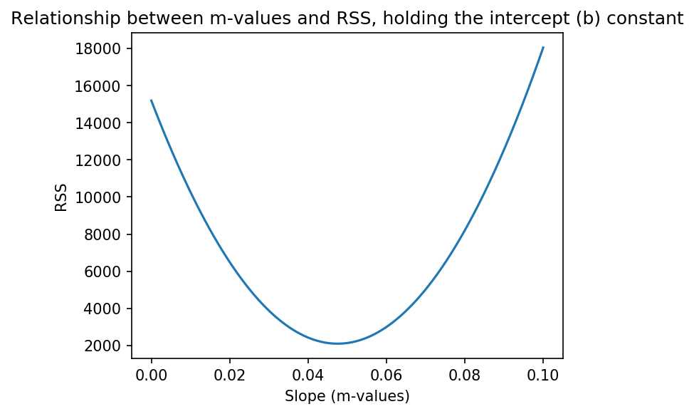

# Calculus, Cost Function, and Gradient Descent


The best fit line that goes through the scatterplot up above can be generalized in the following equation: $$y = mx + b$$


Of all the possible lines, we can prove why that particular line was chosen using the plot down below:



where RSS is defined as the residual sum of squares:

$$ 
\begin{align}
RSS &= \sum_{i=1}^n(actual - expected)^2 \\
&= \sum_{i=1}^n(y_i - \hat{y})^2 \\
&= \sum_{i=1}^n(y_i - (mx_i + b))^2
\end{align}
$$ 

### 1. What is a more generalized name for the RSS curve above? How is it related to machine learning models?


```python

print(
'''The residual sum of squares curve above is a specific example of a cost curve. 

When training machine learning models, the goal is to minimize the cost curve.'''
)
```

    The residual sum of squares curve above is a specific example of a cost curve. 
    
    When training machine learning models, the goal is to minimize the cost curve.


### 2. Would you rather choose a $m$ value of 0.08 or 0.05 from the RSS curve up above?   What is the relation between the position on the cost curve, the error, and the slope `m` of the regression?


```python
print('''
It would be better to have a value of 0.05 rather than 0.08 in the cost curve above. 
The reason for this is that the RSS is lower for the value of 0.05. 

As m changes values from 0.00 to 0.10, the Residual Sum of Squares is changing.

The higher the value of the RSS, the worse the model is performing.

So, the minimum RSS value which occurs ~ an m of .05 indicates it's that slope
which gives us the best fit for this model
''')
```

    
    It would be better to have a value of 0.05 rather than 0.08 in the cost curve above. 
    The reason for this is that the RSS is lower for the value of 0.05. 
    
    As m changes values from 0.00 to 0.10, the Residual Sum of Squares is changing.
    
    The higher the value of the RSS, the worse the model is performing.
    
    So, the minimum RSS value which occurs ~ an m of .05 indicates it's that slope
    which gives us the best fit for this model
    


### 3. Using the gradient descent visual from above, explain why the distance between each step is getting smaller as more steps occur with gradient descent.


```python
print('''
The distance between the steps is getting smaller because the slope gradually 
becomes less and less steep as iterated points for "m" get closer to finding the 
minimum RSS value.

Subtracting the derivative - the slope at a given point - thus means subtracting
a smaller and smaller value, which translates to smaller and smaller distances
between iterated points on the cost curve.  
''')
```

    
    The distance between the steps is getting smaller because the slope gradually 
    becomes less and less steep as iterated points for "m" get closer to finding the minimum.
    
    Subtracting the derivative - the slope at a given point - thus means subtracting
    a smaller and smaller value, which translates to smaller and smaller distances
    between iterated points on the cost curve.  
    


### 4. What is the purpose of a learning rate in gradient descent? Explain how a very small and a very large learning rate would affect the gradient descent.


```python

print('''
Learning rate is a number that is multiplied by each step that 
is taken during gradient descent. 

If the learning rate is smaller, the step sizes will become smaller. 
If the learning rate is larger, the step sizes will be larger. 

Learning rate is present in gradient descent to help ensure that an 
optimal minimum on the cost curve is discovered.
''')
```

    
    Learning rate is a number that is multiplied by each step that 
    is taken during gradient descent. 
    
    If the learning rate is smaller, the step sizes will become smaller. 
    If the learning rate is larger, the step sizes will be larger. 
    
    Learning rate is present in gradient descent to help ensure that an 
    optimal minimum on the cost curve is discovered.
    

