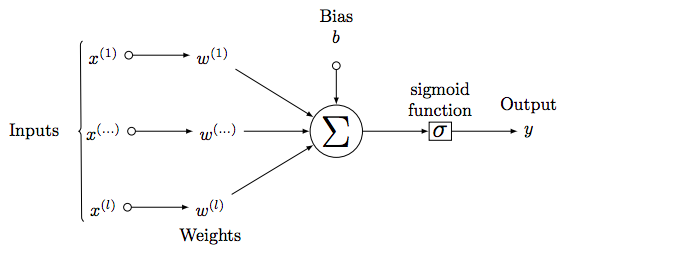

# Perceptrons and Multi Layer Perceptrons


```python
import numpy as np
```

<center><b>The Sigmoid Function</b></center>
$$ \sigma(z) = \frac{1}{1+e^{-z}}$$

<center><b>A Diagram of Simple Perceptron</b></center>



### 1) What are the inputs and outputs of a perceptron?


```python
# Inputs are either exogenous variables or outputs of other perceptrons. 
# The output is the result of the multiplication of weights and biases, the addition of a bias term, 
# and then transformation via an activation function e.g. the sigmoid function.
```

### 2) We've completed the sigmoid function for you. Implement the function `perceptron_output` that takes in an array of inputs (`x`) along with predefined weights (`w`), a bias (`b`) and returns the output of a perceptron. 


```python
def sigmoid(input_function):
    return 1/(1+np.exp(-1*input_function))
```


```python
def perceptron_output(x,w,b):
    
    return sigmoid(np.dot(x,w)+b)
```

This code tests the `perceptron_output` function, and should produce a value of approximately 0.83


```python
x = [1, .19, 1]
w = [.2, .9, .75]
b = 0.5
```


```python
perceptron_output(x,w,b)
```

<center><b>Diagram of a Multi Layer Perceptron</b></center>


### 3) Describe the process of forward propagation in neural networks


```python
# Outputs of each perceptron are propagated to each node of the next layer and scaled by weights specific to each
# of these connections.
```

### 4) How does what happens in forward-propagation change what happens in back-propagation? Be as specific as possible.


```python
# Each time the neural network propagates forward for a given batch, there are residuals due to inaccuracy. 
# To update the weights and biases in the network, the derivatives of each term are calculated using 
# these residuals and then simultaneously updated using the process of gradient descent.
```

### 5) Imagine you are trying classifying audio files into five different classes of sounds. What should your activation function be in the output layer and why? 


```python
# This is a multi-label problem. There should be one output for each label. 
# If a specific output node is over a certain threshold, then that node's label is assigned to that observation.
# The activation function should be a soft max activation.
```
