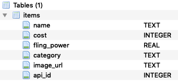

# Mod 1 Code Challenge: Pokémon Items

This assessment is designed to test your understanding of these areas:

1. Importing data
2. Data manipulation in SQL and/or Pandas
3. Creating visualizations using Matplotlib
4. Interpreting and communicating results of an analysis
5. Querying an API

Create a new Jupyter notebook to complete the challenge and show your work. Make sure that your code is clean and readable, and that each step of your process is documented. For this challenge each step builds upon the step before it. If you are having issues finishing one of the steps completely, move on to the next step to attempt every section.

## Business Understanding

Today you're going to use data science tools to optimize your Pokémon game play strategy. You have a **Snorlax** that has learned the **Fling** move, so you are looking to buy an **Item** based on its `fling_power` as well as its cost.

(For the purpose of this exercise, you can ignore all other Pokémon game mechanics, such as which Poké Mart sells which items or the details of the effects of the particular item.)

## Data Understanding

Contained in this repo is a SQLite database named ***pokemon.db***. The name of the table to use is `items`. Using SQL and/or Pandas import the data contained in this database to begin data cleaning and analysis.

## Data Preparation

Once you have your data your tasks are to:

* Select only rows that do not have NaN in the `fling_power` column
* Ensure that the datatype of the `fling_power` and `cost` columns is numeric
* Create a new column `power_per_cost` which is calculated by `fling_power` / `cost`
* Create a dataframe `top_7_items` which includes only the ***7 items*** with the ***highest*** `power_per_cost` in ***descending*** order

## Exploratory Data Analysis

### Tabular Data

After cleaning and preprocessing your data, display the dataframe of the seven selected items within your notebook.  (This can be as simple as creating a variable `top_7_items`, and then typing the name of that variable at the end of a cell.)

### Visualization

Next, create a bar graph to visualize the `cost` of the seven items.  (Not `power_per_cost`, `cost`.) Use the `name` of the item as the label for each bar. This visualization should contain:

* An informative title
* Labeled axes
* An appropriate scale

## Decision Support

Based on your EDA, choose which item you want to buy.  Write a short paragraph describing the information you have distilled, and why you chose the item that you chose.  (You do not need any background knowledge on Pokémon to answer this question.)

## Additional Data Collection with the PokéAPI

Use the PokéAPI ([documentation here](https://pokeapi.co/docs/v2.html#items-section)) to find the **Fling Effect** of your chosen item.

1. Create the request URL with `"https://pokeapi.co/api/v2/item/"` plus the `api_id` of the chosen item.  E.g. `"https://pokeapi.co/api/v2/item/1"` if the `api_id` was 1
2. Use the `requests` library to send a request with this URL and receive the response
3. Convert the content of the response into a Python dictionary with the `.json()` method
4. Using the key `fling_effect`, retrieve information from this dictionary about the effect of using Fling with your chosen item
5. Display this information to the reader in whatever format seems best
6. You may want to consider making additional API calls but this is a BONUS and is not required

# Deliverables Checklist

(Using markdown, mark items as complete in this checklist by changing `[ ]` to `[x]`)

Your main deliverable is a Jupyter notebook containing the following clearly labeled elements:

 - [ ] A pandas dataframe with only the items with the 7 highest `power_per_cost` in descending order
 - [ ] A bar graph visualizing each of the 7 items with their corresponding `cost`
 - [ ] A short paragraph detailing your rationale for what is the best item to purchase based on your analysis
 - [ ] Additional explanation of your chosen item, using data from the PokéAPI
